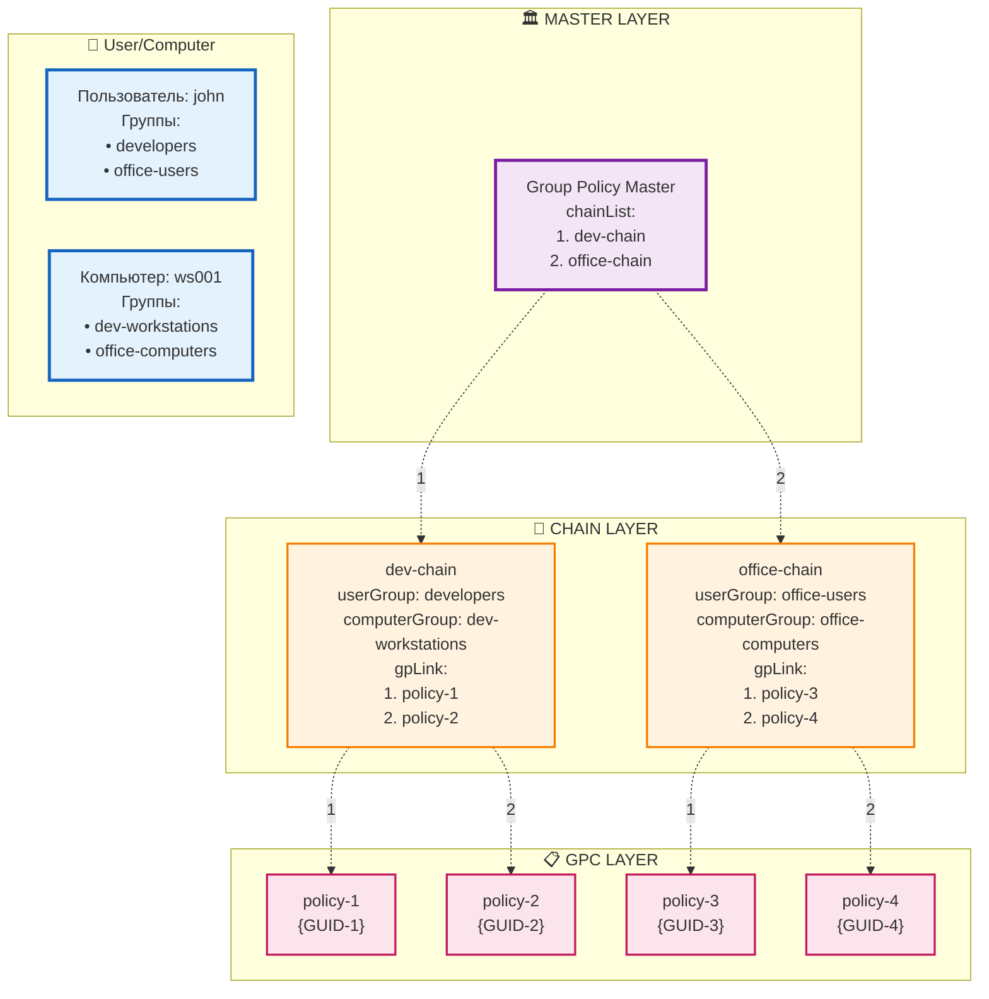

# ipa-gpo-install - Групповые политики для FreeIPA

## Описание

**ipa-gpo-install** — это инструмент для интеграции функций групповых политик в FreeIPA. Пакет расширяет схему LDAP необходимыми объектами и предоставляет CLI и WEB интефрейсы для управления групповыми политиками.

## Как это работает

### Концепция групповых политик

Групповые политики в FreeIPA работают по принципу **многоуровневого наследования настроек**. Система состоит из трех основных компонентов:

1. **Политики** — это наборы правил и настроек

2. **Цепочки** — это связующее звено, которое определяет принадлежность политик к группе пользователей и хостов и последовательность их применения

3. **Мастер групповых политик** — объект, который хранит упорядоченный список всех цепочек в системе и определяет главный сервер для управления политиками

#### Определение приоритетности политик

Когда пользователь входит в систему, политики применяются в строго определенной последовательности:

1. **Обработка цепочек** — система просматривает цепочки в том порядке, в котором они указаны в мастере групповых политик
2. **Фильтрация по принадлежности** — для каждой цепочки проверяется, подходит ли она текущему пользователю и компьютеру
3. **Приоритетность политик внутри цепочки** — если цепочка подходит, политики из неё вычисляются в порядке их следования в атрибуте `gpLink`

#### Управление приоритетами

Приоритеты настраиваются на двух уровнях:

**Уровень цепочек в мастере:**
- Порядок цепочек определяется их позицией в атрибуте `chainList` мастера
- Цепочки, находящиеся выше в списке, имеют более высокий приоритет

**Уровень политик внутри цепочки:**
- Порядок политик определяется их позицией в атрибуте `gpLink` цепочки
- Политики, находящиеся выше в списке, имеют более высокий приоритет
- При конфликте настроек действует политика с более высоким приоритетом

### Устройство реализации

#### Group Policy Container (GPC) — Контейнер политик
Контейнер с настройками и правилами. Каждый GPC содержит:
- Уникальный идентификатор (GUID)
- Название
- Ссылку на директорию с файлами настроек в Sysvol
- Версию политики для отслеживания изменений


#### Group Policy Chain — Цепочка политик
Связующий элемент между группами и политиками. Цепочка определяет:
- Какая группа пользователей получит настройки
- Какая группа компьютеров получит настройки
- Какие именно политики связаны с группами пользователей и машин
- В каком порядке политики получает участники связанных групп


#### Group Policy Master — Главный координатор
Центральный объект управления, который:
- Ведет реестр всех активных цепочек в системе
- Определяет главный сервер для управления политиками
- Поддерживает правильный порядок обработки цепочек

Master обеспечивает согласованность и координацию всей системы групповых политик.

### Схема наследования групповых политик



Схема демонстрирует процесс наследования групповых политик на примере пользователя `john` и компьютера `ws001`.

#### Принадлежность к группам

**Пользователь john** входит в группы:
- `developers`
- `office-users`

**Компьютер ws001** входит в группы:
- `dev-workstations`
- `office-computers`

#### Определение подходящих цепочек

Поскольку пользователь и компьютер входят в группы из **обеих** цепочек, система определяет две подходящие цепочки:

1. **dev-chain** - подходит, так как:
   - john ∈ developers (userGroup)
   - ws001 ∈ dev-workstations (computerGroup)

2. **office-chain** - подходит, так как:
   - john ∈ office-users (userGroup)
   - ws001 ∈ office-computers (computerGroup)

#### Последовательность политик

**Шаг 1: Порядок цепочек**
Group Policy Master определяет порядок обработки через атрибут `chainList`:
```
1. dev-chain (первая в списке)
2. office-chain (вторая в списке)
```

**Шаг 2: Политики из dev-chain**
Находятся в порядке атрибута `gpLink`:
```
1. policy-1 (приоритет 1)
2. policy-2 (приоритет 2)
```

**Шаг 3: Политики из office-chain**
Находятся в порядке атрибута `gpLink`:
```
3. policy-3 (приоритет 1)
4. policy-4 (приоритет 2)
```

#### Итоговая последовательность

Пользователь `john` на компьютере `ws001` получит политики в следующем порядке:

```
policy-1 → policy-2 → policy-3 → policy-4
```

#### Объяснение последовательности

1. **Сначала все политики из dev-chain** - потому что эта цепочка идет первой в `chainList` мастера
2. **Затем все политики из office-chain** - потому что эта цепочка идет второй в `chainList` мастера
3. **Внутри каждой цепочки** политики находятся в порядке их следования в `gpLink`
4. **При конфликте настроек** приоритетнее последняя политика (в данном случае из policy-4)

Такой подход обеспечивает предсказуемое и контролируемое наследование политик с возможностью гибкого управления приоритетами на двух уровнях: уровне цепочек и уровне политик внутри цепочки.


# Установка

### Требования

- FreeIPA сервер
- Права администратора
- Действующий Kerberos-билет

## Установка RPM пакета
    # apt-get install ipa-gpo-install

## Получение Kerberos-билета
    # kinit admin

## Настройка групповых политик
    # ipa-gpo-install

### Параметры установки

ipa-gpo-install [OPTIONS]

Опции:
  --debuglevel LEVEL    Уровень отладки: 0=ошибки, 1=предупреждения, 2=отладка
  --check-only          Только проверка без внесения изменений
  --help               Показать справку

### Что делает установщик

1. **Расширение схемы LDAP** — добавляет новые классы объектов для групповых политик
2. **Создание структуры SYSVOL** — создает каталоги для хранения файлов политик
3. **Настройка Samba** — создает общий ресурс SYSVOL
4. **Проверка AD Trust** — проверяет и при необходимости устанавливает поддержку доверия с AD

## Техническая реализация

### Схема LDAP

**groupPolicyContainer (GPC)**
- `cn` — GUID политики
- `displayName` — отображаемое имя политики
- `distinguishedName` — DN объекта
- `flags` — флаги политики
- `gPCFileSysPath` — путь к файлам политики в SYSVOL
- `versionNumber` — номер версии политики

**groupPolicyChain**
- `cn` — имя цепочки
- `displayName` — отображаемое имя цепочки
- `userGroup` — DN группы пользователей
- `computerGroup` — DN группы компьютеров
- `gpLink` — упорядоченный список DN политик

**groupPolicyMaster**
- `cn` — имя мастер-объекта
- `pdcEmulator` — DN PDC эмулятора
- `chainList` — упорядоченный список цепочек политик

## Команды управления

### Управление политиками

#### Создание политики

    # ipa grouppolicy-add office-security-policy

#### Просмотр политики

    # ipa grouppolicy-show office-security-policy

#### Изменение политики

    # ipa grouppolicy-mod office-security-policy --rename="new-security-policy" \
  --flags=FLAGS

#### Удаление политики

    # ipa grouppolicy-del office-security-policy

#### Поиск политик

    # ipa grouppolicy-find [CRITERIA]

### Управление цепочками политик

#### Создание цепочки

    # ipa chain-add it-chain \
  --display-name="IT Department Chain" \
  --user-group=it-users \
  --computer-group=it-workstations \
  --gp-link=policy1

#### Просмотр цепочки

    # ipa chain-show it-chain --raw

### Изменение цепочки

**Базовые изменения:**

    # ipa chain-mod it-chain \
  [--display-name="New Display Name"] \
  [--user-group=new-user-group] \
  [--computer-group=new-computer-group]

**Добавление групп:**

    # ipa chain-mod it-chain --add-user-group=developers
    # ipa chain-mod it-chain --add-computer-group=dev-machines

**Удаление групп:**

    # ipa chain-mod it-chain --remove-user-group
    # ipa chain-mod it-chain --remove-computer-group

**Работа с политиками в цепочке:**

### Добавление политик
    # ipa chain-mod it-chain --add-gpc="security-policy"
    # ipa chain-mod it-chain --add-gpc="printer-policy"

### Удаление политик
    # ipa chain-mod it-chain --remove-gpc="old-policy"

### Изменение порядка (приоритета)
    # ipa chain-mod it-chain --moveup-gpc="security-policy"
    # ipa chain-mod it-chain --movedown-gpc="security-policy"

### Удаление цепочки

    # ipa chain-del it-chain

### Поиск цепочек

    # ipa chain-find [CRITERIA]

## Управление приоритетами

### Просмотр текущего порядка
    # ipa chain-show policy-chain

### Перемещение политики вверх (повышение приоритета)
    # ipa chain-mod policy-chain --moveup-gpc="critical-policy"

### Перемещение политики вниз (понижение приоритета)
    # ipa chain-mod policy-chain --movedown-gpc="optional-policy"

## Управление мастером групповых политик

#### Просмотр мастера

    # ipa gpmaster-show

#### Добавление цепочки в мастер

    # ipa gpmaster-add-chain chain-name

#### Удаление цепочки из мастера

    # ipa gpmaster-del-chain chain-name

### Перемещение цепочки вверх (повышение приоритета)
    # ipa gpmaster-moveup-chain chain-name

### Перемещение цепочки вниз (понижение приоритета)
    # ipa gpmaster-movedown-chain chain-name

## Примеры использования

### Базовый сценарий

1. **Создание групповой политики:**

        # ipa grouppolicy-add "workstation-security-policy"

2. **Создание цепочки для отдела IT:**

        # ipa chain-add it-policy-chain \
  --display-name="IT Department Policies" \
  --user-group=it-users \
  --computer-group=it-workstations \
  --gp-link="workstation-security-policy"

3. **Добавление дополнительной политики:**

        # ipa grouppolicy-add "printer-policy"
        # ipa chain-mod it-policy-chain --add-gpc="printer-policy"

4. **Изменение приоритета политик:**

        # ipa chain-mod it-policy-chain --moveup-gpc="printer-policy"

## Структура файлов

### SYSVOL
После установки создается структура каталогов:

/var/lib/freeipa/sysvol/
└── domain.example.com/
    ├── Policies/
    │   └── {GUID}/
    │       ├── GPT.INI
    │       ├── Machine/
    │       └── User/

### Файлы политик
Каждая политика создает в SYSVOL структуру:
- `GPT.INI` — метаданные политики
- `Machine/` — настройки для компьютеров
- `User/` — настройки для пользователей

## Права доступа

### Роли и привилегии
Система создает специальную роль **Group Policy Administrators** с правами:
- Чтение всех объектов групповых политик
- Создание, изменение и удаление политик
- Управление цепочками политик

### Назначение прав

    # ipa role-add-member "Group Policy Administrators" --users=username

## Особенности работы системы

### Проверка целостности данных

**При добавлении объектов:**
- Добавление GPC и групп происходит с проверкой на их существование в базе LDAP

**При удалении объектов:**
- При удалении GPC или групп ссылки в цепочках автоматически удаляются плагином ссылочной целостности
- При удалении цепочки она автоматически удаляется из объекта gpmaster
